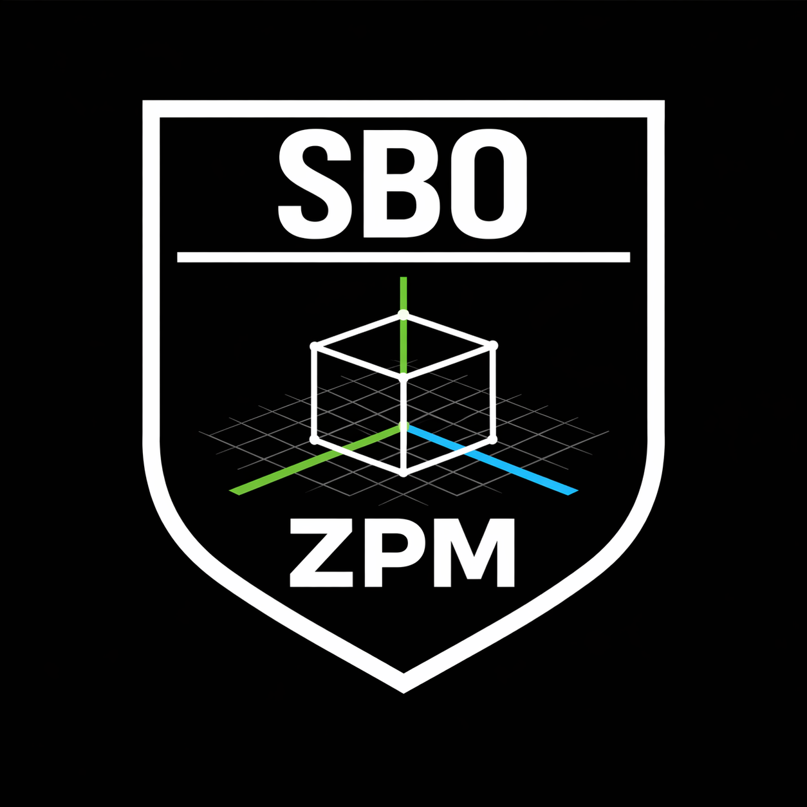

<p align="center">
  
</p>

<h1 align="center">zpm</h1>

<p align="center">
  <strong>The Zig package manager.</strong><br/>
  <sub>Hermetic Efficiency Interference Layer — Über alles.</sub>
</p>

<p align="center">
  
  
  
</p>

<p align="center">
  <code>Unapologetic</code> · <code>Opinionated</code> · <code>Familiar</code> · <code>Efficient</code>
</p>

<p align="center">
  Officially supports <strong>Zig 0.16+</strong> and <a href="https://github.com/sb0-trade/sig"><strong>sig</strong></a>
</p>

---

## Quick Start

```bash
# Install zpm (or build from source — see Contributing)
zpm --version

# Scaffold a new project
zpm init --template cli-app --name my-app
cd my-app

# Install packages
zpm i @zpm/core @zpm/json

# Build and run
zpm run
```

---

## Commands

| Command | Alias | Description |
|---------|-------|-------------|
| `zpm init` | | Scaffold a new project from a template |
| `zpm install <pkg...>` | `i` | Install packages and resolve dependencies |
| `zpm uninstall <pkg...>` | `rm` | Remove packages and orphaned transitive deps |
| `zpm list` | `ls` | List installed zpm packages |
| `zpm search <query>` | | Search the registry for packages |
| `zpm publish` | `pub` | Publish a package to the registry |
| `zpm validate` | `val` | Validate `zpm.pkg.zon` before publishing |
| `zpm update [pkg...]` | `up` | Update packages to latest versions |
| `zpm doctor` | | Check environment health |
| `zpm run [args...]` | | Build and run via `zig build run` |
| `zpm build [args...]` | | Build via `zig build` |

### Global Flags

| Flag | Short | Description |
|------|-------|-------------|
| `--verbose` | `-v` | Detailed output |
| `--quiet` | `-q` | Suppress non-error output |
| `--offline` | | No network requests |
| `--registry <url>` | | Override registry URL |
| `--transport quic` | | Use QUIC transport for registry ops |
| `--help` | `-h` | Show help |
| `--version` | `-V` | Show version |

---

## Templates

`zpm init --template <name> --name <project>`

| Template | Description |
|----------|-------------|
| `empty` | Minimal Zig project (default) |
| `cli-app` | Cross-platform CLI with argument parsing |
| `web-server` | Zig HTTP server project |
| `gui-app` | Platform-abstracted window + GL rendering |
| `library` | Reusable Zig module with `src/root.zig` and tests |
| `package` | Library + `zpm.pkg.zon` manifest for publishing |
| `window` | Native window creation with OpenGL context |
| `gl-app` | OpenGL application with render loop |
| `trading` | Trading application scaffold |

---

## Architecture

Four layers, strictly ordered — lower layers never import from higher layers.

```
Layer 2: Render      Drawing primitives, text, icons (color, primitives, text, icon)
Layer 1: Transport   QUIC stack — RFC 9000/9001/9002/9221 (conn, streams, packet, ...)
Layer 1: Platform    OS bindings, system services (win32, gl, window, http, crypto, ...)
Layer 0: Core        Pure data types, math, logic — no platform deps (core, math, json)
```

### Principles

- No hidden allocations — all storage is stack or comptime-sized
- No implicit work — every cost is visible
- No standard library I/O at runtime — pure platform-native extern calls
- Explicit over convenient
- Zero-cost abstractions only

---

## QUIC Transport

zpm includes a full QUIC implementation (RFC 9000, 9001, 9002, 9221) for high-performance registry access. Enable with `--transport quic`.

Three application lanes map to QUIC primitives:

| Lane | QUIC Primitive | Semantics | Use Cases |
|------|---------------|-----------|-----------|
| Control | Bidirectional stream 0 | Reliable, ordered | Resolve, publish, search, auth |
| Bulk | Bidirectional streams 4+ | Reliable, parallel | Tarball download |
| Hot | DATAGRAM frames | Unreliable, latest-wins | Invalidation, version announcements |

```zig
const conn = @import("conn");
const appmap = @import("appmap");

var connection = conn.Connection.initClient(server_addr);
var app = appmap.AppMap.init(&connection.stream_mgr, &connection.dgram_handler);
app.sendResolveRequest(scope, name, version);
```

---

## Official @zpm/ Packages

34 packages derived from the existing zpm module library.

### Layer 0 — Core

| Package | Description |
|---------|-------------|
| `@zpm/core` | Core data types, storage, and logic |
| `@zpm/math` | Sin/cos approximations, lerp, interpolation, pure math |
| `@zpm/json` | Minimal JSON parser |

### Layer 1 — Platform

| Package | Description |
|---------|-------------|
| `@zpm/win32` | Hand-written Win32 type/constant/extern bindings |
| `@zpm/gl` | OpenGL 1.x constants and function externs |
| `@zpm/window` | Borderless window creation and management |
| `@zpm/timer` | High-precision timer |
| `@zpm/seqlock` | Sequence lock for lock-free concurrent reads |
| `@zpm/http` | HTTP client |
| `@zpm/crypto` | HMAC-SHA256 cryptographic operations |
| `@zpm/file-io` | File I/O operations |
| `@zpm/threading` | Thread pool and worker management |
| `@zpm/logging` | Logging subsystem |
| `@zpm/input` | Keyboard and mouse input handling |
| `@zpm/png` | PNG encoder with deflate compression |
| `@zpm/screenshot` | GL framebuffer capture |
| `@zpm/mcp` | Embedded MCP server |
| `@zpm/platform` | Coarse-grained re-export of all platform subsystems |

### Layer 1 — Transport

| Package | Description |
|---------|-------------|
| `@zpm/udp` | UDP socket I/O (non-blocking send/receive) |
| `@zpm/packet` | QUIC packet parsing and serialization (RFC 9000) |
| `@zpm/transport-crypto` | TLS 1.3 integration and packet protection (RFC 9001) |
| `@zpm/recovery` | Loss detection and congestion control (RFC 9002, NewReno) |
| `@zpm/streams` | Stream management with flow control |
| `@zpm/datagram` | DATAGRAM frame handling (RFC 9221) |
| `@zpm/telemetry` | Per-connection counters and diagnostics |
| `@zpm/scheduler` | Packet assembly and pacing |
| `@zpm/conn` | QUIC connection state machine |
| `@zpm/appmap` | Application protocol mapping (registry ops to QUIC lanes) |
| `@zpm/transport` | Coarse-grained re-export of all transport sub-modules |

### Layer 2 — Render

| Package | Description |
|---------|-------------|
| `@zpm/color` | Color types and constants |
| `@zpm/primitives` | GL immediate-mode drawing: rect, line, candle, glow |
| `@zpm/text` | Bitmap font rasterization |
| `@zpm/icon` | ICO file loading to GL texture |
| `@zpm/render` | Coarse-grained re-export of all render subsystems |

---

## Contributing

See [CONTRIBUTING.md](CONTRIBUTING.md) for build instructions, code style, and PR process.

```bash
# Build from source
cd zpm/cli
zig build

# Run all tests
zig build test --summary all

# Run root-level tests (transport, core, platform)
cd zpm
zig build test --summary all
```

---

<p align="center">
  Every byte accounted for. Every cycle earned.
</p>

<p align="center">
  <a href="https://discord.gg/tXwz7dAt">Discord</a> ·
  <a href="https://ko-fi.com/shadovvbeast">Ko-fi</a> ·
  <a href="https://github.com/sb0-trade/zpm">GitHub</a>
</p>
