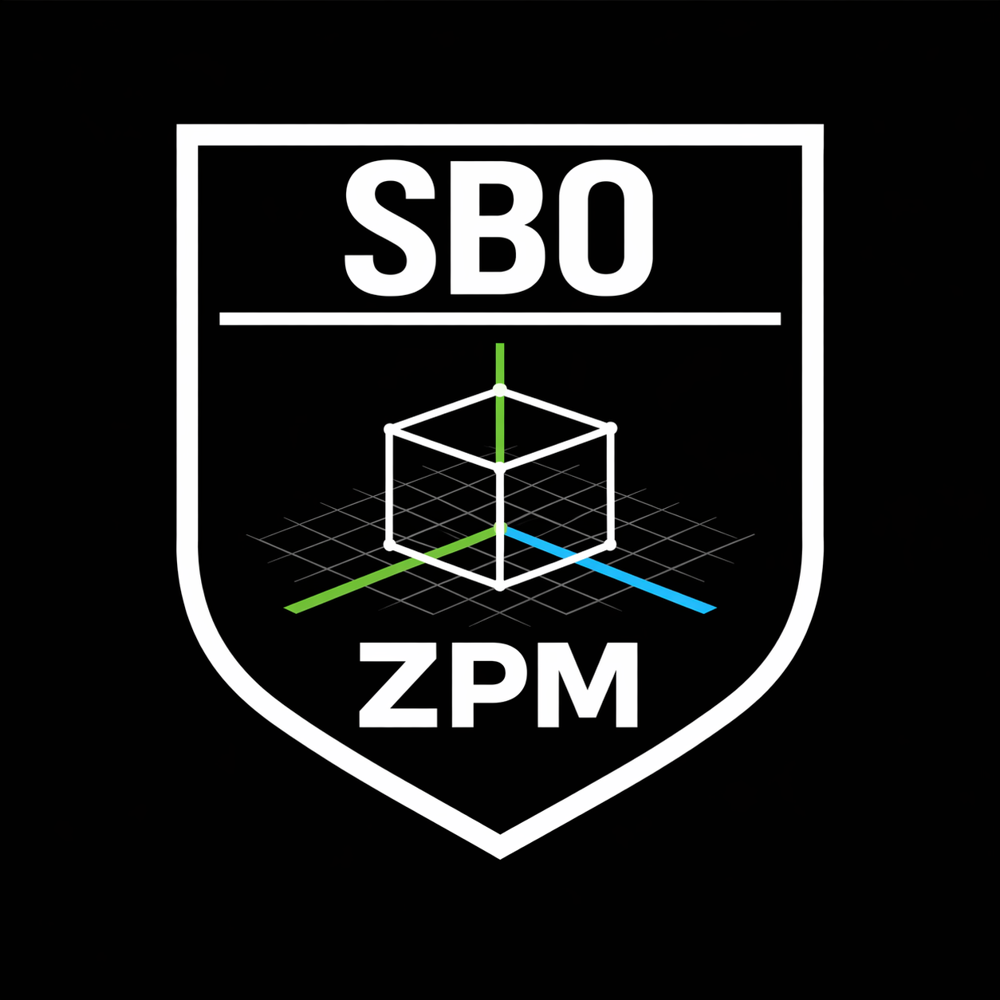

<p align="center">
  
</p>

<h1 align="center">zpm</h1>

<p align="center">
  <strong>The package manager for Sig.</strong><br/>
  <sub>Zero allocations, all platforms — built by the Sig compiler itself.</sub>
</p>

<p align="center">
  
  
  
</p>

<p align="center">
  <code>Unapologetic</code> · <code>Opinionated</code> · <code>Familiar</code> · <code>Efficient</code>
</p>

<p align="center">
  Written entirely in <a href="https://github.com/SB0LTD/sig"><strong>Sig</strong></a> and built with <code>sig build</code>.
</p>

---

## Quick Start

```bash
# Install zpm (or build from source — see Contributing)
zpm --version

# Scaffold a new project
zpm init --template cli-app --name my-app
cd my-app

# Build and run. `sig build` reads build.sig.zon, fetches the declared zpm
# dependency (a pinned github.com/SB0LTD/zpm tarball) into the Sig global
# cache, verifies its SHA-256, and wires its modules — no separate install
# step required for the scaffolded dependency.
zpm run
```

> Package source: zpm modules are distributed as the
> [github.com/SB0LTD/zpm](https://github.com/SB0LTD/zpm) source tree. Scaffolded
> projects pin it as a `build.sig.zon` dependency (`.url` + `.hash`) that the
> Sig toolchain fetches and verifies on build. A hosted package registry
> (`registry.zpm.dev`) is planned but not yet deployed; the `install`/`search`/
> `publish` commands target it and require `--registry` until then.

---

## Commands

| Command | Alias | Description |
|---------|-------|-------------|
| `zpm init` | | Scaffold a new project from a template |
| `zpm install <pkg...>` | `i` | Install packages and resolve dependencies |
| `zpm uninstall <pkg...>` | `rm` | Remove packages and orphaned transitive deps |
| `zpm list` | `ls` | List installed zpm packages |
| `zpm search <query>` | | Search the registry for packages |
| `zpm publish` | `pub` | Publish a package to the registry |
| `zpm validate` | `val` | Validate `zpm.pkg.zon` before publishing |
| `zpm update [pkg...]` | `up` | Update packages to latest versions |
| `zpm doctor` | | Check environment health |
| `zpm run [args...]` | | Build and run via `sig build run` |
| `zpm build [args...]` | | Build via `sig build` |

### Global Flags

| Flag | Short | Description |
|------|-------|-------------|
| `--verbose` | `-v` | Detailed output |
| `--quiet` | `-q` | Suppress non-error output |
| `--offline` | | No network requests |
| `--registry <url>` | | Override registry URL |
| `--transport quic` | | Use QUIC transport for registry ops |
| `--help` | `-h` | Show help |
| `--version` | `-V` | Show version |

---

## Templates

`zpm init --template <name> --name <project>`

| Template | Description |
|----------|-------------|
| `empty` | Minimal Sig project (default) |
| `cli-app` | Cross-platform CLI with argument parsing |
| `web-server` | Sig HTTP server project |
| `gui-app` | Platform-abstracted window + GL rendering |
| `library` | Reusable Sig module with `src/root.sig` and tests |
| `package` | Library + `zpm.pkg.zon` manifest for publishing |
| `window` | Native window creation with OpenGL context |
| `gl-app` | OpenGL application with render loop |
| `trading` | Trading application scaffold |

---

## Architecture

Four layers, strictly ordered — lower layers never import from higher layers.

```
Layer 2: Render      Drawing primitives, text, icons (color, primitives, text, icon)
Layer 1: Transport   QUIC stack — RFC 9000/9001/9002/9221 (conn, streams, packet, ...)
Layer 1: Platform    OS bindings, system services (win32, gl, window, http, crypto, ...)
Layer 0: Core        Pure data types, math, logic — no platform deps (core, math, json)
```

### Implementation Language

zpm is implemented entirely in **Sig** (`.sig` files) and built by the
[Sig compiler](https://github.com/SB0LTD/sig) with its native, allocator-free
`sig build` system. Sig shares Zig's syntax and semantics, so the manifest and
build-file formats are familiar.

- `build.sig` — the build file (canonical for Sig projects)
- `build.sig.zon` — the package manifest
- `build.zig` / `build.zig.zon` — legacy Zig-named equivalents are still parsed,
  so existing projects keep working

`zpm init` scaffolds `build.sig` + `build.sig.zon`, and `zpm build` / `zpm run`
delegate to `sig build` regardless of which naming a project uses.

### Principles

- No hidden allocations — all storage is stack or comptime-sized
- No implicit work — every cost is visible
- No standard library I/O at runtime — pure platform-native extern calls
- Explicit over convenient
- Zero-cost abstractions only

---

## QUIC Transport

zpm includes a full QUIC implementation (RFC 9000, 9001, 9002, 9221) for high-performance registry access. Enable with `--transport quic`.

Three application lanes map to QUIC primitives:

| Lane | QUIC Primitive | Semantics | Use Cases |
|------|---------------|-----------|-----------|
| Control | Bidirectional stream 0 | Reliable, ordered | Resolve, publish, search, auth |
| Bulk | Bidirectional streams 4+ | Reliable, parallel | Tarball download |
| Hot | DATAGRAM frames | Unreliable, latest-wins | Invalidation, version announcements |

```zig
const conn = @import("conn");
const appmap = @import("appmap");

var connection = conn.Connection.initClient(server_addr);
var app = appmap.AppMap.init(&connection.stream_mgr, &connection.dgram_handler);
app.sendResolveRequest(scope, name, version);
```

### HTTP/3 server primitives

`src/transport/h3.sig` provides bounded HTTP/3 frame parsing, static-table
QPACK, and an incremental request-stream decoder. `src/transport/server.sig`
adds the fixed-capacity QUIC/HTTP/3 server loop and route dispatcher. Request
bodies are streamed into caller-provided storage and may arrive across any
number of QUIC fragments or DATA frames.

### SB0 application SDK

`src/platform/sb0/app_v1.sig` is the versioned, allocator-free userspace SDK
for the consolidated SB0 ABI. It exposes device queues plus delegated network
and storage capabilities; the runtime supplies the concrete `sb0_abi` import.
The SDK contract version is `1.0.0`.

---

## Official @zpm/ Packages

Official packages are published under the `@zpm/` scope and derived from the
zpm module library. They are organized by the four-layer hierarchy above.

### Layer 0 — Core

| Package | Description |
|---------|-------------|
| `@zpm/core` | Core data types, storage, and logic |
| `@zpm/math` | Sin/cos approximations, lerp, interpolation, pure math |
| `@zpm/json` | Minimal JSON parser |
| `@zpm/ai-core` | Caller-owned arenas, tensor bounds, deadline scheduling, device interfaces, and copy-on-write pages |
| `@zpm/model-observability` | Fixed-capacity model/device tracing, replay cursors, and latency histograms |
| `@zpm/multimodal-now` | Confidence/freshness fusion with bounded compute budgets |

### Layer 1 — Platform

| Package | Description |
|---------|-------------|
| `@zpm/win32` | Hand-written Win32 type/constant/extern bindings |
| `@zpm/gl` | OpenGL 1.x constants and function externs |
| `@zpm/window` | Borderless window creation and management |
| `@zpm/timer` | High-precision timer |
| `@zpm/seqlock` | Sequence lock for lock-free concurrent reads |
| `@zpm/http` | HTTP client |
| `@zpm/crypto` | HMAC-SHA256 cryptographic operations |
| `@zpm/file-io` | File I/O operations |
| `@zpm/threading` | Thread pool and worker management |
| `@zpm/logging` | Logging subsystem |
| `@zpm/input` | Keyboard and mouse input handling |
| `@zpm/png` | PNG encoder with deflate compression |
| `@zpm/screenshot` | GL framebuffer capture |
| `@zpm/mcp` | Embedded MCP server |
| `@zpm/platform` | Coarse-grained re-export of all platform subsystems |

### Layer 1 — Transport

| Package | Description |
|---------|-------------|
| `@zpm/udp` | UDP socket I/O (non-blocking send/receive) |
| `@zpm/packet` | QUIC packet parsing and serialization (RFC 9000) |
| `@zpm/transport-crypto` | TLS 1.3 integration and packet protection (RFC 9001) |
| `@zpm/recovery` | Loss detection and congestion control (RFC 9002, NewReno) |
| `@zpm/streams` | Stream management with flow control |
| `@zpm/datagram` | DATAGRAM frame handling (RFC 9221) |
| `@zpm/telemetry` | Per-connection counters and diagnostics |
| `@zpm/scheduler` | Packet assembly and pacing |
| `@zpm/conn` | QUIC connection state machine |
| `@zpm/appmap` | Application protocol mapping (registry ops to QUIC lanes) |
| `@zpm/transport` | Coarse-grained re-export of all transport sub-modules |

### Layer 2 — Render

| Package | Description |
|---------|-------------|
| `@zpm/color` | Color types and constants |
| `@zpm/primitives` | GL immediate-mode drawing: rect, line, candle, glow |
| `@zpm/text` | Bitmap font rasterization |
| `@zpm/icon` | ICO file loading to GL texture |
| `@zpm/render` | Coarse-grained re-export of all render subsystems |

### Layer 0 — Crypto

| Package | Description |
|---------|-------------|
| `@zpm/sha256` | SHA-256 hashing |
| `@zpm/hmac` | HMAC-SHA256 |
| `@zpm/hkdf` | HKDF key derivation |
| `@zpm/aes` | AES block cipher |
| `@zpm/gcm` | AES-GCM authenticated encryption |
| `@zpm/x25519` | X25519 key exchange (RFC 7748) |
| `@zpm/p256` | NIST P-256 (Montgomery CIOS) |

### Layer 0 — Networking

| Package | Description |
|---------|-------------|
| `@zpm/net-ipv4` | IPv4 packet handling |
| `@zpm/net-tcp` | TCP segment handling |
| `@zpm/net-udp` | UDP datagram handling |
| `@zpm/net-dns` | DNS resolver |
| `@zpm/net-dhcp` | DHCP client |
| `@zpm/net-arp` | ARP |
| `@zpm/net-icmp` | ICMP |
| `@zpm/net-http` | Minimal HTTP over the native TCP stack |

### Layer 0 — AI / Inference

| Package | Description |
|---------|-------------|
| `@zpm/gguf` | GGUF model file parsing |
| `@zpm/tokenizer` | Tokenizer with index |
| `@zpm/qwen3-executor` | Qwen3 decode plan + executor |
| `@zpm/inference-session` | Bounded inference session driver |
| `@zpm/kv-cache` | Attention KV cache |
| `@zpm/sampling` | Token sampling |
| `@zpm/quantized-linear` | Quantized linear kernels |
| `@zpm/transformer-ops` | Transformer building blocks |
| `@zpm/vector-memory` | Bounded vector memory store |
| `@zpm/agent-runtime` | Agent runtime primitives |

### Layer 0 — Image / Document

| Package | Description |
|---------|-------------|
| `@zpm/image` | Software image buffers and compositing |
| `@zpm/png-decode` | PNG decoding |
| `@zpm/layout` | Layout analysis |
| `@zpm/text-analyze` | Text detection over image buffers |
| `@zpm/elementor-document` | Structured document model |

### Layer 0 — Language Server (LSP)

| Package | Description |
|---------|-------------|
| `@zpm/lsp` | Coarse-grained re-export of the LSP building blocks |
| `@zpm/message` | LSP JSON-RPC message framing |
| `@zpm/document` | Text document + position mapping |
| `@zpm/symbols` | Symbol model |
| `@zpm/server` | LSP server core |
| `@zpm/loop` | LSP event loop |
| `@zpm/jwrite` | Bounded JSON writer |

---

## Contributing

See [CONTRIBUTING.md](CONTRIBUTING.md) for build instructions, code style, and PR process.

```bash
# Build from source (requires the Sig compiler on PATH)
cd zpm/cli
sig build

# Run all tests
sig build test --summary all

# Run root-level tests (transport, core, platform)
cd zpm
sig build test --summary all
```

---

<p align="center">
  Every byte accounted for. Every cycle earned.
</p>

<p align="center">
  <a href="https://discord.gg/tXwz7dAt">Discord</a> ·
  <a href="https://ko-fi.com/shadovvbeast">Ko-fi</a> ·
  <a href="https://github.com/SB0LTD/zpm">GitHub</a>
</p>
